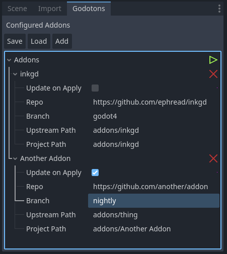
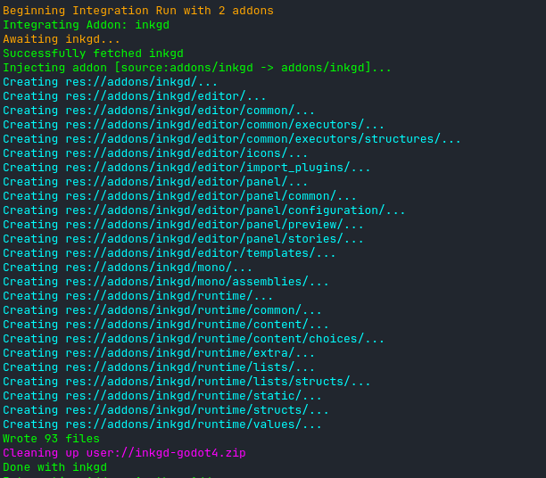

# Godotons
  

A godot addon in pure GDScript for managing out of band (not in asset-lib) Libraries in Godot 4.2+

You ever have a Godot addon that hasn't made it on to the asset library yet, requires a compatibility branch, 
or the asset library updates too slowly for you?

Godoton attempts to solve this by maintaining a minimal configuration file from which it
does an Integration/Apply run to download the given repo:branch and then inject the 
defined path (ex. addon/inkgd) to the local project path (ex. addon/inkgd)

This project is *very* new and in no way considered stable or ready for production,
however I am curious to have people try it out and suggest improvements or other
enhancements / PRs.

# Usage

Enable the plugin and then use the Godotons Dock to add remote sources.

> :warning: **Save/Load are vestigal**: Save and Load currently still work however the addon now auto saves after every change like ProjectSettings so they are largely vestigal in nature (haven't decided which way to go yet)

* Addon Settings
    * Name
        * Changed by clicking the label beside the dropdown chevron
        * Only used in editor messaging and as storage key
    * Update on Apply
        * Whether or not to download and inject if the directory already exists
    * Repo
        * The remote git repo from which to inject (only tested against github public repos)
        * http(s):// required
    * Branch
        * The remote branch to fetch when downloading the archive to inject
        * Default: `main`
        * Many addons have compatibility branches (ex. godot4)
    * Upstream Path
        * The path on the remote repo to inject
        * Example: `addons/inkgd`
        * Useful if you don't need the rest of the repo such as Examples/ directories or an addon bundles in too much
    * Project Path
        * The path within the project to inject the `Upstream Path`
        * Ex. `addons/inkgd`
        * Technically can allow you to fetch *only* the addon directory and then repeat the addon configuration to *only* inject another resource elsewhere such as Examples/ but ignore the rest of the repo

The green PLAY button applies the addon configuration. This will download the addon repo branch, extract only the UpstreamPath and then copy it to the ProjectPath.

The red X button will delete the addon.

# Planned Features

- [ ] Clean up and handle errors/messaging better for Asset Store release
- [ ] Compare local hash with repo somehow before downloading to save on API requests / data transfer
- [ ] Ignore option to skip an addon for apply runs
- [ ] Ability to apply single addon or all addons
- [ ] Investigate threading the apply step.
- [ ] Investigate refreshing on editor reimport
- [ ] Implement tests
- [ ] Investigate self-updating addon when in a foreign project (if even detectable)
- [ ] Investigate supporting private repos
- [ ] Keep a backup copy of the config's last change to handle mis-deletes etc. Stretch goal: pop confirmation possible?
- [X] Maintain list of repos / branch to fetch / path in remote repo to copy into addons/
- [X] Download repo from remote host (via /archive URI)
- [X] Inject only the specified UpstreamPath from the repo into the specified ProjectPath (ex. addons/inkgd -> addons/inkgd)
- [X] Optionally disable re-running download/injection if addon is already installed

# Notes / Known Issues
### In no particular order

* Notes
    * Save/Load behavior may change
* Known Issues
    * Currently isn't deleting the zip archive files from user:// for some reason. Investigation is on going (TODO: write an issue and put it here)
    * Won't gracefully handle config schema changes. Need to implement some schema version or something to prevent it blowning up on Godoton addon updates.
    * Won't refresh on reimport, have to hit Load

# Contributing
We are open to contributions with no particular style guide defined yet as the project is in early development.

Particular areas of interest:

- [ ] File operation improvements (ex. is there a way to avoid writing the files to disk as an extra step when we already have the []bytes?)
- [ ] UI: Improvements
- [ ] Better interactions with Git - use API? Compare hashes (store last injected hash)?
- [ ] Tests/Testing implementation

# License

MIT 

# Authors

### Ducking Games
* [Charles \<asciifaceman\> Corbett](https://github.com/asciifaceman/)
