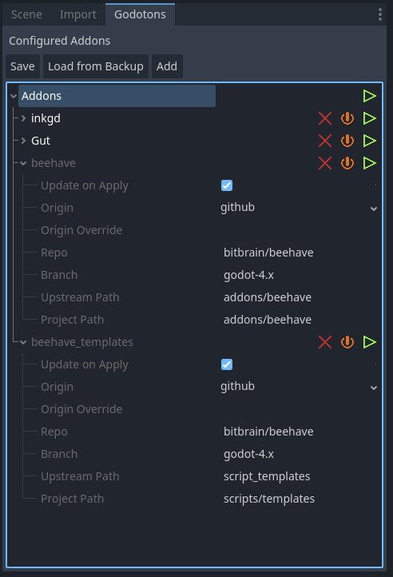
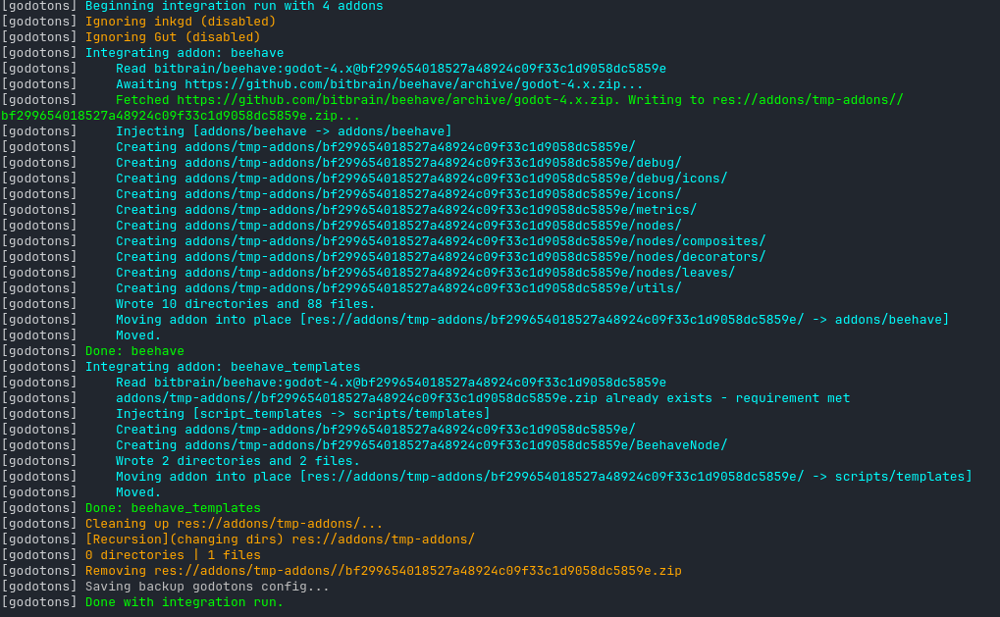

# Godotons
  


A godot addon in pure GDScript for managing out of band (not in asset-lib) Libraries in Godot 4.2+

You ever have a Godot addon that hasn't made it on to the asset library yet, requires a compatibility branch, 
or the asset library updates too slowly for you?

Godoton attempts to solve this by maintaining a minimal configuration file from which it
does an Integration/Apply run to download the given repo:branch and then inject the 
defined path (ex. addon/inkgd) to the local project path (ex. addon/inkgd)

This project is *very* new and in no way considered stable or ready for production,
however I am curious to have people try it out and suggest improvements or other
enhancements / PRs.

<p align="center">


</p>

# Installation

### Install

Download Godotons whichever way you prefer and install the addons/godotons into your project

(Hopefully will be on the asset library at some point for initial install!)

Linux example
```bash
wget https://github.com/Ducking-Games/godotons/archive/refs/heads/main.zip
mkdir addons
unzip main.zip
mv godotons-main/addons/godotons addons
rm -rf main.zip godotons-main/
```

Enable the addon and never manually install or update an addon again (hopefully)

### (Optional) Add Godotons to manage its own updates
```ini
[godotons]

name="godotons"
hidden=false
enabled=true
update=true
origin="github"
origin_override=""
repo="Ducking-Games/godotons"
branch="main"
upstream_path="addons/godotons"
project_path="addons/godotons"
```
TODO: Update below from 0.1.0 to 0.20 output
```
Run integration on one addon: godotons
Integrating addon: godotons
    Awaiting https://github.com/Ducking-Games/godotons/archive/main.zip...
    Fetched godotons-main.zip. Writing...
    Injecting addon [addons/godotons -> addons/godotons]
    Creating res://addons/godotons/
    Creating res://addons/godotons/components/
    Wrote 2 directories & 10 files.
Cleaning up res://addons/temp/...
Done: godotons
```


# Usage

Enable the plugin and then use the Godotons Dock to add remote sources.

> :warning: **Save/Load are vestigal**: Save and Load currently still work however the addon now auto saves after every change like ProjectSettings. There is active work going on with save/load to improve it.

* Addon Settings
    * Name
        * Changed by clicking the label beside the dropdown chevron
        * Only used in editor messaging and as storage key
        * No spaces (automatically replaced with underscores)
    * Enabled on Apply
        * Whether or not to skip the addon entirely during a run
        * Toggled via the Power button on the addon
        * Use to disable an addon in Godotons without removing it from the config
    * Update on Apply
        * Whether or not to download and inject if the directory already exists and the latest commit hash was installed
    * Origin
        * Upstream provider
        * Only supports github right now (gitlab soon)
    * OriginOverride
        * can be ignored for now - will be used to support enterprise installs with custom URLs
    * Repo
        * The remote git repo from which to inject (only tested against github public repos)
        * in the form of owner/repo (ex. `Ducking-Games/godotons`)
    * Branch
        * The remote branch to fetch when downloading the archive to inject
        * Many addons have compatibility branches (ex. godot4)
        * If unsure use `main` or `master` (depending on the source)
    * Upstream Path
        * The path on the remote repo to inject
        * Example: `addons/inkgd`
        * Useful if you don't need the rest of the repo such as Examples/ directories or an addon bundles in too much
    * Project Path
        * The path within the project to inject the `Upstream Path`
        * Ex. `addons/inkgd`
        * Technically can allow you to fetch *only* the addon directory and then repeat the addon configuration to *only* inject another resource elsewhere such as Examples/ but ignore the rest of the repo

The green PLAY button applies the addon configuration. This will download the addon repo branch, extract only the UpstreamPath and then copy it to the ProjectPath.

Individual addons can be run, or the entire suite can be run.

The red X button will delete the addon.

# Planned Features

- [X] Clean up and handle errors/messaging better for Asset Store release
- [X] Compare local hash with repo somehow before downloading to save on API requests / data transfer
- [X] Ignore option to skip an addon for apply runs
- [X] Ability to apply single addon or all addons
- [ ] Investigate threading the apply step.
- [X] Investigate refreshing on editor reimport
- [ ] Implement tests
- [ ] Investigate self-updating addon when in a foreign project (if even detectable)
- [ ] Investigate supporting private repos
- [X] Keep a backup copy of the config's last applied configuration
- [X] Maintain list of repos / branch to fetch / path in remote repo to copy into addons/
- [X] Download repo from remote host (via /archive URI)
- [X] Inject only the specified UpstreamPath from the repo into the specified ProjectPath (ex. addons/inkgd -> addons/inkgd)
- [X] Optionally disable re-running download/injection if addon is already installed

# Notes / Known Issues
### In no particular order

* Notes
    * Save/Load behavior may change
* Known Issues
    * Won't gracefully handle config schema changes. Need to implement some schema version or something to prevent it blowning up on Godoton addon updates.
    * Cannot fetch from repo root directories, must be in a subdirectory

# Contributing
We are open to contributions with no particular style guide defined yet as the project is in early development.

Particular areas of interest:

- [ ] File operation improvements (ex. is there a way to avoid writing the files to disk as an extra step when we already have the []bytes?)
- [ ] UI: Improvements
- [ ] Better interactions with Git - use API? Compare hashes (store last injected hash)?
- [ ] Tests/Testing implementation


# License

MIT 

# Authors

### Ducking Games
* [Charles \<asciifaceman\> Corbett](https://github.com/asciifaceman/)
